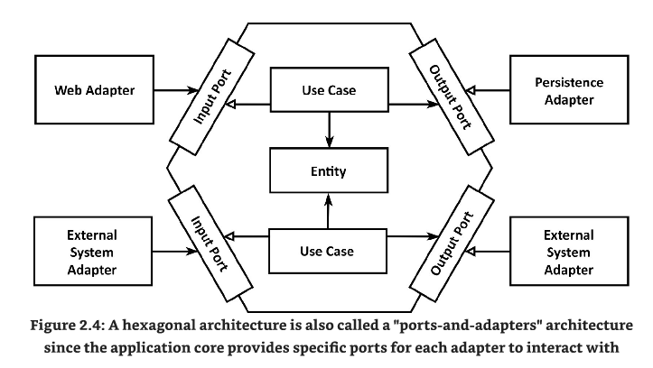

# Workshop: Clean Code & Architecture

This project aims to show how Clean Code & Clean Architecture can be applied onto a usual software web-project.
Also, we want to show you which frameworks / plugins we usually use in our projects, and why.

### Pre-Requisites

In order to get the most out of this workshop, it is advised that you read the following books,
since they explain a lot of the ideas / thoughts that are applied in this project,
and show the pain that can arise if you do not follow these tips.

#### Clean Code: A Handbook of Agile Software Craftsmanship by Robert C. Martin

https://www.amazon.de/Clean-Code-Handbook-Software-Craftsmanship/dp/0132350882

You will find the effects of this book in all code, from frontend to backend to the persistence layer.
The book resolves mostly about what "Clean Code" is on a smaller to medium scale, meaning how you can write
clean classes, interfaces and services. Also, there are chapters about writing tests and loads more, but on the smaller scale.

After reading this book, you can discuss your learnings in your team and improve your code quality instantly.

#### Clean Architecture: A Craftsman's Guide to Software Structure and Design by Robert C. Martin

https://www.amazon.de/Clean-Architecture-Craftsmans-Software-Structure/dp/0134494164

This book is sort of a predecessor of `Clean Code` but works on a higher level, how to connect services and applications
with each other, how to handle **dependencies** and choosing the right **Software Architecture** for your project.

If you want to dive deeper into this topic go ahead, if you want something a bit easier to read, with
great examples and more hands-on, we would recommend reading the next book:

#### Get Your Hands Dirty on Clean Architecture by Tom Hombergs

https://reflectoring.io/book/

This book talks about how to implement the learnings & ideas from **Clean Architecture** and 
apply them on an **Hexagonal Architecture** design. It also gives great examples about how to 
structure your code and talks about which shortcuts you could go and the effects / downsides.

This project is heavily influenced by this book, so also check out his GitHub repository to see how 
you could implement such an architecture with Java.
https://github.com/thombergs/buckpal

# Hexagonal Architecture
Also known as the `Ports & Adapters Architecture`, you will understand why at the end of the workshop or
after reading the backend code.

The main idea is to not follow the conventional `Layered Architecture`, which split the application into
+ Frontend
+ Backend
+ Database

or similar approaches like **Model-View-Controller** (MVC).

Instead, we want to keep the most important part of our application, the **Business Logic**, in the core
and resolve everything else around it.

## Delaying Decisions
This diagram (from the book How to get your hands dirty on clean architecture mentioned above) shows the idea.
We want the Business Logic (UseCases & Entities) in the middle, giving it great stability and not dependent on other frameworks / applications.

Then we have the left side of the diagram, the so called **Driving Ports / Adapters**.
They call our application (via REST API / JMX Endpoints / etc.) via our ports and make our application do something.
These ports don't contain business logic, only mapping the incoming data and calling UseCases.

On the right side we have **Driven Ports / Adapters**.
These are interfaces, which our application calls to save / fetch data, call external APIs, etc.
Again, they don't contain any business logic, only mapping the data from our application to the e.g. database layer,
talking to the database, sending queries, authenticating on external APIs.

By doing this, we keep all uncertainties and things we cannot control far away from our business logic.
This makes it easy to **delay decisions** - say you just start your own private project, at first you
might not need an external database, maybe a in-memory DB works just fine, after a few weeks of development
you find out you have more data than you thought. By keeping all the database logic far away from your business logic,
you don't have to change anything from your core application - even the ports stay the same. 
You can just switch out the database adapters to call a MySQL / MariaDB or anything else.

Same for external APIs, over the time their APIs may change, their DTOs may move or get completely restructured.
But by keeping them far away you only have to change the mapping to our internal business entities.

## Pros & Cons
Of course this architecture isn't flawless and perfect for every project, so here are some thoughts from us:

### Pros
+ UseCase driven
  + You think about the UseCase (Business Logic) first and write everything around that, instead of thinking first about how to save the data the easiest.
+ Reveals intent
  + Just by looking through the package structure you see which in- and outgoing ports your application has
  + See all UseCases the application implements
+ Dependency Management
  + with this setup, you cannot access the database directly from the controller
  + not even the persistence dependencies leak to your business logic
    + with the exception of Spring, but you could also abstract the Spring annotations 
+ Working well in teams
  + By not having services for entities (e.g. UserService) which contains all the logic for users you tend to have less merge conflicts
    + resulting in smaller classes making it easier to test
  + Also seeing which classes are required / used for other UseCases is quite easy
+ Scaling really well

### Cons
+ more overhead
  + more mapping (from incoming ports to business entities to outgoing ports)
  + more files (every UseCase is its own file, as well as every port)
